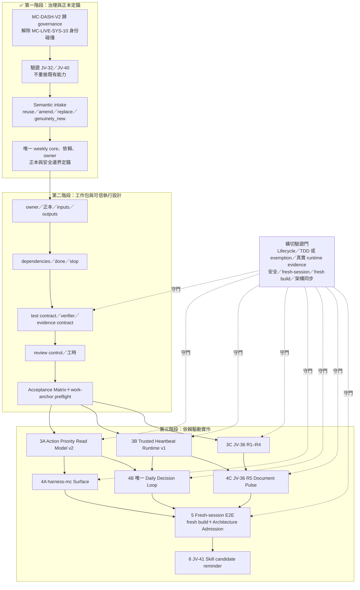
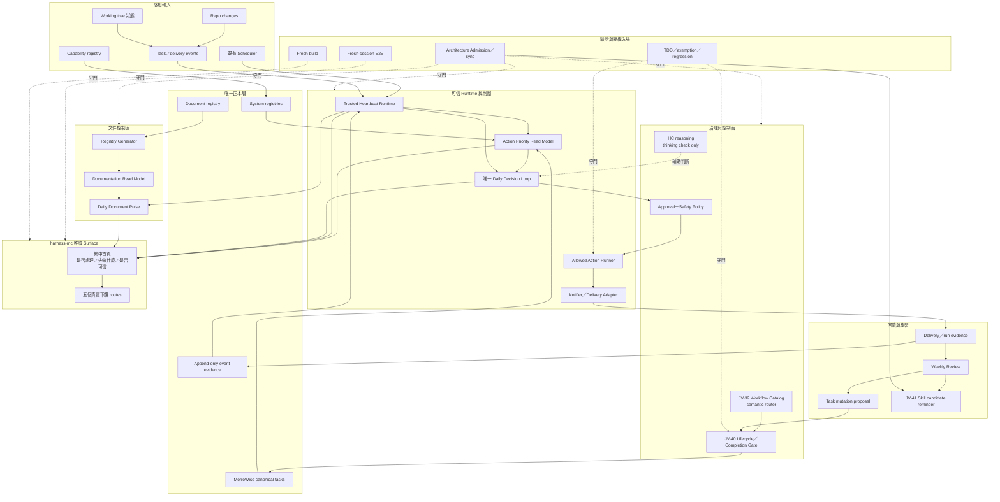

# MorroWise 第二階段交接

> 日期：2026-07-26
> 狀態：第一階段已封版；第二階段部分完成；第三階段尚未開始
> Work anchor：`morrowise/action-priority-read-model-v2`
> Weekly review date：`2026-07-29`

## 1. 交接目的

本文件讓下一個 Agent 不依賴聊天紀錄即可接續 MorroWise 三階段計畫，並明確區分：

- 已完成且不得重新打開的第一階段治理成果。
- 第二階段固定、可封閉的七項缺口。
- 尚未開始的第三階段實作與最終架構入場。
- canonical source、generated read model、runtime evidence 與 harness-mc Surface 的責任邊界。
- 目前 repo 的未提交修改及不得誤碰的既有 dirty state。

本輪不建立第二份 tracker、第二套 scheduler、平行 daily decision loop 或額外 worktree。

## 2. 必讀與唯一正本

開始前依序讀取：

1. `$COLLAB/AGENTS.md`
2. `$COLLAB/notyet-harness/000_Agent/CORE.md`
3. `$COLLAB/notyet-harness/000_Agent/SOUL.md`
4. `$COLLAB/notyet-harness/000_Agent/USER.md`
5. `$COLLAB/notyet-harness/000_Agent/memory/MEMORY.md`
6. `$COLLAB/notyet-harness/000_Agent/ARCHITECTURE.md`
7. `$COLLAB/notyet-harness/000_Agent/skills/SKILLS-INDEX.md`
8. `$COLLAB/harness-mc/AGENTS.md`

唯一正本：

| 類型 | Source of truth |
|---|---|
| MorroWise 系統、runtime、read model、治理 gate | `$COLLAB/harness-mc/milestones/morrowise/tasks.json` |
| harness-mc 首頁、下鑽頁、UI Surface | `$COLLAB/harness-mc/milestones/harness-mc/tasks.json` |
| 架構能力登記 | `$COLLAB/harness-mc/system-workflow/registries/morrowise-architecture-subsystems.json` |
| Shared architecture human entry | `$COLLAB/notyet-harness/000_Agent/ARCHITECTURE.md` |
| Generated read models | 衍生唯讀資料，不得手改 |
| Heptabase、Canvas、Dashboard | Mirror／Surface，不得反向覆蓋 task 正本 |

所有 canonical task mutation 必須經 JV-40 lifecycle gate。UI、heartbeat、document pulse 與 Skill candidate reminder 均不得直接修改 canonical task state。

## 3. 三階段總覽

1. **第一階段：治理與正本定錨**
   鎖定 task identity、owner、source of truth、dependency、semantic intake、weekly core、安全邊界與禁止事項。

2. **第二階段：工作包與可信執行設計**
   補齊每包的輸入、輸出、開始／完成依賴、完成條件、停止條件、verifier、test contract、review control、工時與 Acceptance Matrix。Action Priority 是唯一使用 root `review_date` 的 weekly core，其餘七包使用 informational planning `review_window`。

3. **第三階段：依賴驅動實作、整合與架構入場**
   完成 Action Priority、Trusted Heartbeat、JV-36、Surface、Daily Decision、Document Pulse，最後執行 Fresh-session E2E、fresh build 與 Architecture Admission。

TDD、runtime evidence、安全、fresh-session、fresh build 與架構同步屬於橫切驗證門，不是第四階段，也不是第三階段的唯一主體。

## 4. 開發過程架構圖



## 5. 第一階段完成結果

第一階段已完成並封版，不得因第二或第三階段的新證據不足而回頭宣告第一階段失敗。

| 項目 | 裁決 | Canonical 狀態 |
|---|---|---|
| `mc-dashboard-priority-ia-v2`／MC-DASH-V2 | amend 為 governance | completed |
| JV-32 `morrowise-dev-workflow-catalog` | reuse | completed |
| JV-40 `task-lifecycle-jv32-gate` | amend | in_progress |
| `action-priority-read-model-v2` | genuinely_new | in_progress、唯一 weekly core |
| `trusted-heartbeat-runtime-v1` | genuinely_new | todo |
| Reality Tax daily decision | replace | successor 已建立 |
| `morrowise-live-decision-loop-v1` | replacement successor | todo |
| `morrowise-priority-dashboard-surface-v2`／MC-LIVE-SYS-10 | genuinely_new、歸 harness-mc | todo |
| JV-36 `document-source-registry-and-human-sync` | amend R1–R5 | todo |
| `morrowise-phase3-fresh-session-e2e-admission` | genuinely_new | todo |
| JV-41 `skill-candidate-review-gate` | reuse／amend dependency | todo |

第一階段已鎖定：

- 零個 task identity collision。
- 零個平行 task system。
- 零個平行 scheduler。
- 零個平行 daily decision loop。
- 零個自動延期規則。
- 每個候選只有一個 semantic intake outcome。
- 系統 task 與 UI Surface task 分屬正確正本。

## 6. 第二階段目前完成內容

八個相關工作包均已存在，不需要新增 task：

1. `task-lifecycle-jv32-gate`
2. `action-priority-read-model-v2`
3. `trusted-heartbeat-runtime-v1`
4. `document-source-registry-and-human-sync`
5. `morrowise-live-decision-loop-v1`
6. `morrowise-priority-dashboard-surface-v2`
7. `morrowise-phase3-fresh-session-e2e-admission`
8. `skill-candidate-review-gate`

已完成：

- 8/8 有 lifecycle operation。
- 8/8 有 `done_condition`。
- 8/8 有 acceptance prose。
- 8/8 有 `test_contract`。
- 8/8 有一致的 `execution_contract`。
- 8/8 有 start／completion `dependency_gates`；JV-36 另具 R1–R4／R5 staged dependencies。
- 8/8 有可審查的 `estimated_hours`。
- 8/8 有正式 `acceptance_matrix`。
- Action Priority 保持唯一 root `review_date=2026-07-29`；其餘 7/8 有 informational planning `review_window`。
- 8/8 最新 canonical mutation 均有合法 `amend` lifecycle event、semantic intake 與 Vincent approval。
- Final Admission task 已建立。
- JV-41 已依賴 Final Admission task。
- Action Priority 是唯一 weekly core，`review_date=2026-07-29`。
- MorroWise changed-only task validator 為 0 issue。
- harness-mc 目標修改未新增 warning；目前輸出的 40 項皆為既有 legacy warning。

## 7. 最終 P2 合約與固定七項驗收

第二階段只依以下七項驗收；通過後即封版，不再把第三階段實作證據倒灌成第二階段條件。

| ID | 驗收項目 | 狀態 | 完成條件 |
|---|---|---|---|
| P2-01 | JV-40 execution contract | 已完成 | 在既有 JV-40 task 補齊一致 contract，不建新 task |
| P2-02 | JV-36 分段依賴 | 已完成 | 同一 JV-36 task 明確區分 R1–R4 start gate 與 R5 Heartbeat completion gate |
| P2-03 | Surface start／completion dependency | 已完成 | Action Priority 為 start gate；Action Priority、Heartbeat、Daily Decision 為 completion gates |
| P2-04 | Review control | 已完成 | Action Priority 保留唯一 root `review_date`；其餘七包使用可信 informational planning `review_window` |
| P2-05 | Estimated hours | 已完成 | 8/8 補上可審查的 estimated hours |
| P2-06 | Acceptance Matrix | 已完成 | 8/8 具 stable ID、前置資料、步驟、pass、fail、verification |
| P2-07 | 驗證與封版 | 待完成 | 固定 P2 驗證通過並完成 scoped commit；push 僅在 Vincent 明確核准後執行 |

### 第二階段工作包固定欄位

每包必須具有：

`task id → operation → owner → source of truth → inputs → outputs → start dependencies → completion dependencies → done condition → stop condition → test contract → verifier → review control → estimated hours → Acceptance Matrix`

### Test contract 邊界

Test contract 至少定義：

- Observable behavior。
- Unit／integration／runtime／E2E 層級。
- 預期 Red reason。
- Green command。
- Full regression commands。
- Fixture 與真實 runtime evidence 的界線。
- 不適用 TDD 時的 exemption reason 與替代 verifier。

純文件或治理 task 不強迫程式 Red／Green，但必須有可驗證 exemption 與可重跑替代 verifier。

目前 `test_contract.evidence_refs` 為空、六個規劃中的 verifier 尚未實作，屬第三階段工作，不算第二階段新增缺口。

## 8. 第二階段封閉順序

1. 已在既有八個 canonical task 完成 P2-01 至 P2-06 amendment。
2. 跑 changed-only validator、task verifier 與 scoped diff checks；會寫入 generated data 的驗證只能在隔離副本執行，不得覆寫既有 dirty。
3. 使用 scoped commit 流程提交已核對的 P2 範圍。
4. Push 必須有 Vincent 明確核准；未核准時記為 `READY_TO_PUSH`，不視為 P2 驗收失敗。

Heptabase／Canvas publication 是非阻擋的 post-P2 mirror closeout；只有 Vincent 要求實際發布時才需要確認精確 target，不納入 P2 exit gate。

第二階段 exit gate：

- P2-01 至 P2-07 全部通過。
- Work-anchor preflight 回傳 `allow`。
- 無新增 source-of-truth、registry、tracker、scheduler 或 daily loop。
- Canonical source、Acceptance Matrix 與 lifecycle evidence 可追溯。

合約凍結規則：

- P2 只依 P2-01 至 P2-07 驗收，不再新增 exit gate。
- 只有 source-of-truth 衝突、安全問題、資料遺失／覆寫風險或合約內部矛盾可以重開 P2。
- 其他新發現一律排入第三階段或改善建議。

## 9. 第三階段實作

### 3A Action Priority Read Model v2

輸入：

- Canonical MorroWise tasks。
- priority、dependency、weekly core、review date。
- verifier、freshness 與 runtime status。

輸出：

- 去重後的 eligible actions。
- 是否需要處理。
- 下一個應處理項目。
- suppressed／blocked reason。
- source、generated time、freshness、verifier 與 next action。

禁止 UI、fixture 或第二份 task list 反向決定 priority；read model 不得修改 task state。

### 3B Trusted Heartbeat Runtime v1

沿用既有 agent-agnostic scheduler，取得安全且真實的 machine/run evidence，輸出：

- Declared schedule。
- Loaded runtime。
- Last successful run。
- Freshness。
- Degraded／blocked reason。
- Evidence reference 與 next action。

不得新建第二套 scheduler、讀取 secrets、直接修改 task state，或以 fixture／plist 存在偽裝 runtime 成功。

### 3C JV-36 R1–R4

- R1：文件適用範圍、seed inventory、folder contract、分類 vocabulary。
- R2：document registry、schema、coverage 與漏登記 verifier。
- R3：generator、documentation read model、ARCHITECTURE 薄索引。
- R4：diff impact gate、changed-only sync、跨 repo two-phase check。

### 4A harness-mc Surface

- 全繁中首頁。
- 首頁只回答「要不要處理、先做什麼、資料是否可信」。
- 詳細資訊放入五個真實下鑽 route。
- 只讀 Action Priority 與明列的 Heartbeat／Decision evidence。
- 不直接拼讀 tasks、fixture 或舊 dashboard read model。

### 4B 唯一 Daily Decision Loop

只使用 `morrowise-live-decision-loop-v1`：

`Action Priority → Reality Tax → recommendation → approval policy → action／hold`

保留 Reality Tax 30 分鐘與 24 小時 outcome check；不得新增第二個 loop、scheduler 或自動延期規則。

### 4C JV-36 R5

同時依賴 R1–R4 與 Trusted Heartbeat：

- 每日檢查 registry、coverage、diff impact、cross-repo sync 與 freshness。
- 沒有真實 run evidence 時只能 degraded／not live。
- 只能檢查與報告。
- 禁止背景修改文件、task、commit 或 push。

### 5 Final Admission

Canonical task：`morrowise-phase3-fresh-session-e2e-admission`

全部通過才可完成第三階段：

- Fresh session 不帶 task id 仍選對 task 與 semantic route，或輸出一致且可追溯的拒絕理由。
- 多 Agent、多次重跑結果 deterministic。
- Runtime 使用真實 safe probe／run evidence。
- Priority、Heartbeat、Decision、Document Pulse 與 Surface 均能追到正本及 verifier。
- Fresh single-repo production build 通過。
- Task validator 通過。
- Architecture Admission Record 更新或明確裁決 `not_required`。
- 受控 `ARCHITECTURE.md` sync check 通過。

### 6 JV-41

Final Admission 通過後，JV-41 只可輸出：

- `not_applicable`
- `observe`
- `create_skill`
- `update_skill`

不得自動建立、修改、安裝 Skill 或新增背景排程。

## 10. 最終系統架構圖

以下為完成第三階段後的目標架構，不代表目前 runtime 或 UI 已完成。



## 11. 橫切驗證門

| Gate | 要求 |
|---|---|
| Governance | 唯一 owner、source of truth、task identity |
| Lifecycle | create／amend／replace／complete 均經 JV-40 |
| Test | TDD 或明確 exemption、regression evidence |
| Runtime | 真實 safe probe、run evidence、freshness |
| Safety | Approval policy、secret boundary、禁止背景寫入 |
| Consistency | Fresh session、多 Agent、多次重跑一致 |
| Surface | UI 唯讀，不產生第二份真相 |
| Build | Changed-only validator、fresh production build |
| Architecture | Registry triage、Admission、controlled sync |
| Skill | 只提醒，不自動建立或修改 |

## 12. Repo 現況與安全邊界

截至 2026-07-26：

- Repo：`$COLLAB/harness-mc`
- Branch：`codex/jv32-traditional-task-title`
- Upstream：`origin/codex/jv32-traditional-task-title`
- Ahead／behind：`0/0`
- HEAD：`31af8c6 fix(tasks): restore follow-up task lifecycle evidence`
- 前一筆 Phase 1 commit：`62915d8 docs(morrowise): close MC-DASH-V2 phase-one governance`
- P2-01 至 P2-06 的兩份 canonical task amendment 與 review-window validator／fixtures 目前未提交。

本輪預期範圍：

- `milestones/morrowise/tasks.json`
- `milestones/harness-mc/tasks.json`
- `milestones/morrowise/notes/morrowise-phase2-handoff-2026-07-26.md`
- `scripts/validate-tasks.mjs`
- `scripts/verify-validate-tasks.mjs`

目前另有既存或來源未確認的 dirty／untracked 內容，必須保留且不得混入本輪 commit：

- `public/data/notion-sync-state.json`
- `public/data/tools.json`
- `public/data/verifier-suite-health.json`
- `milestones/fj-116-admissions/`
- `milestones/morrowise/maps/MorroWise_最終系統架構圖_V3_260726.svg`
- `milestones/morrowise/maps/MorroWise_開發過程架構圖_V3_260726.svg`
- `milestones/morrowise/maps/morrowise-development-architecture.html`
- `milestones/morrowise/maps/morrowise-final-system-architecture.html`
- 既有 `task-events/pending/` 事件。

不得 revert、刪除、stage 或重新產生上述內容，除非先確認其 owner 與 scope。

一般單人開發預設使用目前 branch 依序完成，不建立 worktree。只有並行工作、緊急 hotfix 或明確核准的 legacy exception 才可使用隔離 worktree。

## 13. 已取得驗證證據

- `node scripts/validate-tasks.mjs --changed-only --project morrowise`：0 issue、0 warning。
- `node scripts/validate-tasks.mjs --changed-only --project harness-mc`：通過；40 項為既有 legacy warning，目標 task 未新增 warning。
- `git diff --check -- milestones/morrowise/tasks.json milestones/harness-mc/tasks.json`：通過。
- 最終 P2 canonical task coverage audit：8/8。
- `node scripts/verify-validate-tasks.mjs`：通過。
- 前一輪 isolated single-repo fresh production build：通過。
- 目前 live working tree 的 local build 曾受未追蹤 `milestones/fj-116-admissions/` 缺少 PAI domain mapping 影響；這不是本輪 MorroWise task 變更造成，不得為了通過 build 擅改該專案。

## 14. 安全接續程序

```bash
cd "$COLLAB/harness-mc"
git fetch --prune
git rev-list --left-right --count HEAD...@{upstream}
git -c core.quotepath=false status --short
node scripts/work-anchor-preflight.mjs --project morrowise --task-id action-priority-read-model-v2 --intent "完成第二階段" --json
```

確認 preflight 為 `allow` 後，只完成尚未結束的 P2-07 verification／closeout。驗證至少包含：

```bash
node scripts/validate-tasks.mjs --changed-only --project morrowise
node scripts/validate-tasks.mjs --changed-only --project harness-mc
node scripts/verify-validate-tasks.mjs
npm run test:tasks
npm run test:architecture-subsystems
npm run test:system-pulse
python3 "$COLLAB/notyet-harness/000_Agent/scripts/sync-architecture-subsystems.py" --check
git diff --check
```

Commit 前只 stage 本輪已核對範圍，使用 `worktree-commit` 防呆流程並等待 Vincent 明確 `可以 commit`。Push 需另取得明確 `可以 push`。

## 15. 交接完成判定

本文件記錄最終 P2 合約；目前 P2-01 至 P2-06 已完成，P2-07 verification／closeout 尚未完成。

下一個 Agent 的唯一近期目標是完成 P2-07、跑完第二階段 exit gate，依 scoped commit 流程提交；push 只在 Vincent 明確核准時執行。不得在此之前開始第三階段 runtime、UI、document pulse 或 Skill 實作，也不得再回頭重開第一階段。
